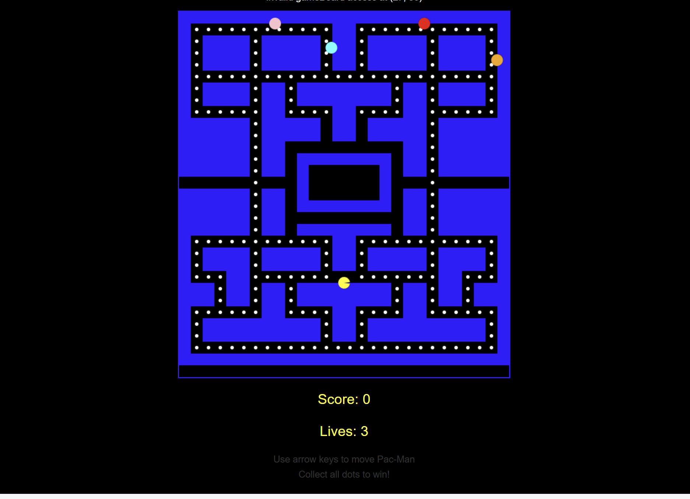
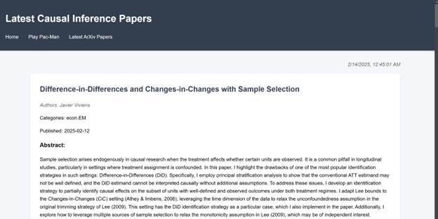

# Coding Blog Website

## Introduction

Welcome to my coding blog website! This repository contains the source code for my personal coding blog, featuring:

- A clean and responsive homepage
- A playable Pac-Man game
- Auto-updating ArXiv papers page

## Installation

To set up the project locally, follow these steps:

1. **Clone the repository:**
    ```bash
    git clone https://github.com/hannahjin28/stock_website
    cd stock_website
    ```

2. **Install dependencies:**
    - For the Python script to update ArXiv papers, you need to install the `arxiv` package:
    ```bash
    pip install arxiv
    ```

3. **Open the website:**
    - You can open `index.html` in your browser to view the homepage.
    - To play the Pac-Man game, open `pacman.html`.
    - To view the latest ArXiv papers, open `papers.html`.

## Usage

### Sample Usage

1. **Homepage:**
    - Open `index.html` in your browser.
    - You should see a clean and modern design showcasing the main content.

2. **Pac-Man Game:**
    - Open `pacman.html` in your browser.
    - Use the arrow keys to control Pac-Man. Collect all dots to win!
    - The score and lives are displayed on the screen.

3. **ArXiv Papers:**
    - Open `papers.html` in your browser.
    - The page will display the latest research papers in computer science.
    - The papers are updated daily using a GitHub Action.

### Expected Output

- **Homepage:**
    

- **Pac-Man Game:**
    

- **ArXiv Papers:**
    

## Report

### Case Study: Using AI Copilot for Three Problems

I forked https://github.com/phillipnicol/stock_website to create an initial repository to host my webpage. Then, I began using Github Copilot to address assignment requirements. In this section, I will describe how I used AI tools, specifically GitHub Copilot, to solve three problems in this project. I primarily used Claude 3.5 Sonnet, with the only exception being that I used GPT 4o to help create pacman and to draft this README. 

#### Problem 1: Implementing the Pac-Man Game

**Tools Used:**
- GitHub Copilot

**Approach:**
1. **Prompt Design:**
    - I started by describing the basic requirements for the Pac-Man game, such as the game board, Pac-Man's movement, and ghost behavior.
    - Example prompt: "Create a Pac-Man game with a grid-based board, where Pac-Man can move using arrow keys and collect dots."

2. **Adjustments:**
    - I iteratively refined the prompts to handle specific game mechanics, such as collision detection and ghost movement.
    - Example adjustment: "Ensure ghosts can move around the areas that Pac-Man can move to and avoid getting stuck."
    - It was helpful to view the html errors (e.g., by clicking "Developer Tools" on Chrome browser) and then send Copilot these errors. I initially mostly used Claude 3.5 Sonnet, but when this AI model repeatedly could not solve the issue of making pacman visible, I switched to GPT 4o. I alternated betweenn Claude 3.5 Sonnet and GPT 4o whenever one model seemed stuck.

3. **Outcome:**
    - The AI provided code snippets that I integrated and tested, resulting in a functional Pac-Man game.

#### Problem 2: Auto-Updating ArXiv Papers

**Tools Used:**
- GitHub Copilot
- GitHub Actions

**Approach:**
1. **Prompt Design:**
    - I described the need for a script to fetch the latest ArXiv papers and update a JSON file.
    - Example prompt: "Write a Python script to fetch the latest ArXiv papers and save them to a JSON file."

2. **Adjustments:**
    - I refined the prompts to handle specific requirements, such as formatting the JSON output and scheduling the updates using GitHub Actions.
    - Example adjustment: "Create a GitHub Action to run the Python script daily at midnight UTC."

3. **Outcome:**
    - The AI provided the necessary code for the Python script and GitHub Action, which I integrated and tested.

#### Problem 3: Designing the Homepage

**Tools Used:**
- GitHub Copilot

**Approach:**
1. **Prompt Design:**
    - I described the layout and styling requirements for the homepage.
    - Example prompt: "Create a responsive homepage with a header, navigation, and main content area."

2. **Adjustments:**
    - I refined the prompts to handle specific design elements, such as card layouts and responsive grids.
    - Example adjustment: "Add my name, "Hannah Jin," to the home page."

3. **Outcome:**
    - The AI provided CSS and HTML code snippets that I integrated and tested, resulting in a clean and responsive homepage.

### Contributions

Hannah Jin: wrote prompts for Copilot, tested/debugged code, edited README

Github Copilot using Claude 3.5 Sonnet and GPT 4o: coding, debugging, and drafting README

BST 236 instructors: homework design and debugging
